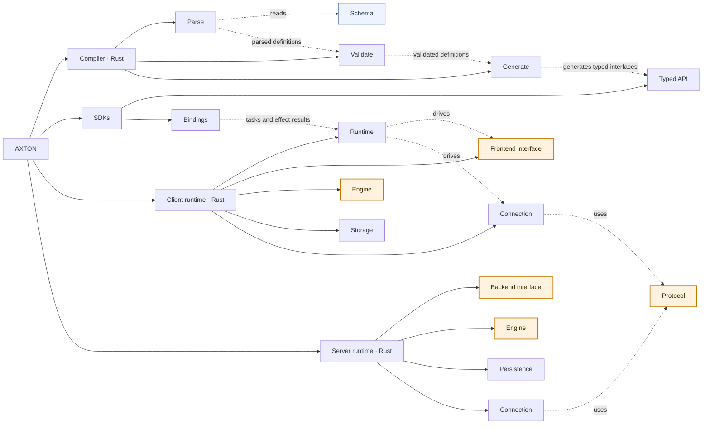

# Architecture

See the [component documentation index](architecture/README.md) for individual design documents.

## Core

Five parts carry the product: three define what synchronization guarantees, two define what a developer writes against. Design discussions start here; everything else adapts to them.

| Core part | Why |
| --- | --- |
| [Protocol](architecture/protocol/README.md) | The wire contract the two engines agree on: receipts, pages, stamps, cursors. Changing it changes the product. |
| [Client / Engine](architecture/client/engine/README.md) | Optimistic writes, the durable call queue, authority applied by stamp, completion from receipts. |
| [Client / Frontend interface](architecture/client/frontend-interface.md) | What a frontend author writes against: reads, writes, transactions, subscriptions and status, one command at a time, in the order the [runtime](architecture/client/runtime.md) schedules them. |
| [Server / Engine](architecture/server/engine/README.md) | Per-mutation execution and readback, publication, receipts, pages by cursor. The client engine's counterpart. |
| [Server / Backend interface](architecture/server/backend-interface.md) | What a backend author writes against: the host contract between handlers/loaders and the engine. |

The compiler is a tool, the SDKs and connections carry bytes, storage and persistence are adapters, the schema is input. They are marked ★ in the tree and shaded in the graph below.

## Components

The tree stops at three levels: AXTON, a component, a part. A part that has internal structure keeps its own tree in its README and owns every page below it; nothing deeper appears here.

- **[Schema](architecture/schema/README.md)** — User-written, language-independent definitions of Models, fields, identities, Mutations and Queries.
  - **[Types](architecture/schema/types.md)** — Scalar and enum types, lists and nullability.
  - **[Models](architecture/schema/models.md)** — Fields, identities, unique constraints and read-contract versions.
  - **[Relations](architecture/schema/relations.md)** — References, inverse relations and deletion rules.
  - **[Slot mutations](architecture/schema/mutations.md)** — The low-level slot block: operation groups, argument bindings, versions and sequencing.
  - **[Mutations and Queries](architecture/schema/actions.md)** — Versioned backend operations: business kind, inputs, outputs and delivery defaults.
  - **[Prerequisites](architecture/schema/prerequisites.md)** — Prerequisite declarations and references.
- ★ **[Protocol](architecture/protocol/README.md)** — Language-independent push, pull, receipt and subscription message formats.
  - **[Common](architecture/protocol/common.md)** — Shared fields, counters and encoding conventions.
  - **[Push](architecture/protocol/push.md)** — Durable call batches, receipts carrying per-call outcomes and record authority.
  - **[Direct calls](architecture/protocol/actions.md)** — Request/response envelope and replay by call ID.
  - **[Pull](architecture/protocol/pull.md)** — Requests, record changes, cursors and pagination.
  - **[Subscriptions](architecture/protocol/subscriptions.md)** — WebSocket subscription requests and acknowledgments.
- **[Compiler (Rust)](architecture/compiler/README.md)** — Compile schemas and generate typed interfaces.
  - **[Parse](architecture/compiler/parse.md)** — Convert schema text into structured definitions.
  - **[Validate](architecture/compiler/validate.md)** — Check types, references and mutations in the parsed definitions.
  - **[Generate](architecture/compiler/generate.md)** — Produce runtime descriptors and typed SDK interfaces from validated definitions.
- **[SDKs (TypeScript, Dart, etc.)](architecture/sdks/README.md)** — Convert typed calls to runtime tasks and outcomes back; execute the effects the runtime asks for.
  - **[Typed API](architecture/sdks/typed-api/README.md)** — Expose strongly typed client and server APIs to applications.
  - **[Bindings](architecture/sdks/bindings.md)** — Carry task submissions, events and wakes between the language and one runtime per client.
- **[Client runtime (Rust)](architecture/client/README.md)** — Local state, storage and sync.
  - **[Runtime](architecture/client/runtime.md)** — Own every task from submission to outcome: scheduling, the application transaction, the connection lanes, direct calls and observers.
  - ★ **[Frontend interface](architecture/client/frontend-interface.md)** — Expose reads, writes, subscriptions and status to the runtime.
  - ★ **[Engine](architecture/client/engine/README.md)** — Local reads and writes, the mutation queue, completion from receipts and page application.
  - **[Storage](architecture/client/storage/README.md)** — Execute Engine-requested SQL and transactions; table layout, schema compatibility and replica rebuild.
  - **[Connection](architecture/client/connection/README.md)** — HTTP/WebSocket transport and the controller that decides when to push, stream, catch up and retry.
- **[Server runtime (Rust)](architecture/server/README.md)** — Sync protocol and backend execution.
  - ★ **[Backend interface](architecture/server/backend-interface.md)** — Invoke application handlers and loaders through one typed host contract.
  - ★ **[Engine](architecture/server/engine/README.md)** — Process mutations, read their results back, publish, serve pulls and produce receipts.
  - **[Persistence](architecture/server/persistence.md)** — Persist sync metadata within the application's transaction; no business logic.
  - **[Connection](architecture/server/connection/README.md)** — HTTP/WebSocket transport, subscriptions and streaming.

## Component graph

Components and their parts; each part's own structure is drawn in its README. Both connection controllers are Rust: the client's Downlink worker (`DownlinkWorker`, with `LiveSession` as its socket session), driven by the client [runtime](architecture/client/runtime.md), and the server's subscription controller (`Subscriptions`); the language packages execute their effects or actions and keep no sync decision.

Solid lines show composition; dashed lines are labeled with contract use or data flow. Shaded nodes are the core parts.

## Code map

Where each part lives. A part with its own tree carries the finer map in its README; every leaf page names its code in section 5.

| Component / part | Code location |
|---|---|
| Schema | Source syntax in [compiler/parse.rs](../../crates/compiler/src/parse.rs) |
| Protocol | [core/protocol.rs](../../crates/core/src/protocol.rs), including the shared `limits` and the subscription messages |
| Compiler / Parse | [compiler/parse.rs](../../crates/compiler/src/parse.rs); file concatenation and error relocation in [compiler/main.rs](../../crates/compiler/src/main.rs) |
| Compiler / Validate | `validate` and the `Validated` types in [compiler/validate.rs](../../crates/compiler/src/validate.rs); version history and fence in [compiler/history.rs](../../crates/compiler/src/history.rs) |
| Compiler / Generate | Descriptors in [compiler/generate.rs](../../crates/compiler/src/generate.rs), represented by [core/schema.rs](../../crates/core/src/schema.rs); typed interfaces in [compiler/emit.rs](../../crates/compiler/src/emit.rs); output files in [compiler/main.rs](../../crates/compiler/src/main.rs) |
| SDKs / Typed API | [client-js](../../packages/client-js), [dart](../../packages/dart/lib), [server/index.mts](../../packages/server/index.mts); model-specific classes and typed signatures are compiler output ([map](architecture/sdks/typed-api/README.md#code-map)) |
| SDKs / Bindings | Per-client actor and its C ABI in [bindings/common/src/actor.rs](../../bindings/common/src/actor.rs) and [ffi.rs](../../bindings/common/src/ffi.rs); carriers in [bindings/node](../../bindings/node/src/client.rs), [bindings/dart](../../bindings/dart/src/lib.rs) and [bindings/mobile](../../bindings/mobile/src/lib.rs); SDK Bridges in [client-js/bridge.mts](../../packages/client-js/bridge.mts) and [dart/bridge.dart](../../packages/dart/lib/src/bridge.dart) |
| Client / Runtime | [client/runtime](../../crates/client/src/runtime) (`ClientRuntime`, the bridge contract in `protocol.rs`) ([modules](architecture/client/runtime.md#5-building-block-view)) |
| Client / Frontend interface | [client/lib.rs](../../crates/client/src/lib.rs); per-transaction handle in [client/engine.rs](../../crates/client/src/engine.rs) |
| Client / Engine | [crates/client/src](../../crates/client/src): `mutate.rs`, `rows.rs`, `query.rs`, `queue.rs`, `policies.rs`, `push.rs`, `downlink.rs`, `ledger.rs`, `authority.rs` ([map](architecture/client/engine/README.md#code-map)) |
| Client / Storage | [client/store.rs](../../crates/client/src/store.rs), [client/ddl.rs](../../crates/client/src/ddl.rs), [client/schema_store.rs](../../crates/client/src/schema_store.rs), [sqlite/lib.rs](../../crates/sqlite/src/lib.rs) ([map](architecture/client/storage/README.md#code-map)) |
| Client / Connection | [client/connection.rs](../../crates/client/src/connection.rs), [client/transport.rs](../../crates/client/src/transport.rs), [client/downlink_worker.rs](../../crates/client/src/downlink_worker.rs), [client/live.rs](../../crates/client/src/live.rs), driven by [client/runtime/lanes.rs](../../crates/client/src/runtime/lanes.rs); effect executors in [client-js/connection.mts](../../packages/client-js/connection.mts) and [dart/connection.dart](../../packages/dart/lib/src/connection.dart) ([map](architecture/client/connection/README.md#code-map)) |
| Server / Backend interface | Operation contract in [server/host.rs](../../crates/server/src/host.rs) and [server/host-contract.mts](../../packages/server/host-contract.mts); `Host` in [server/lib.rs](../../crates/server/src/lib.rs); handler/loader dispatch in [server/index.mts](../../packages/server/index.mts) |
| Server / Engine | [server/lib.rs](../../crates/server/src/lib.rs), [server/settlement.rs](../../crates/server/src/settlement.rs), [server/readback.rs](../../crates/server/src/readback.rs); `changes`, `publish` and `WakeHub` in [server/index.mts](../../packages/server/index.mts) ([map](architecture/server/engine/README.md#code-map)) |
| Server / Persistence | `Database<T>` in [server/index.mts](../../packages/server/index.mts); SQL, driver interface and the `pg`/`prisma`/`drizzle` shims in [packages/postgres](../../packages/postgres); tables in [migration.sql](../../packages/postgres/migration.sql) |
| Server / Connection | HTTP and WebSocket in [server/index.mts](../../packages/server/index.mts); controller `Subscriptions` in [server/live.rs](../../crates/server/src/live.rs) ([map](architecture/server/connection/README.md#code-map)) |
