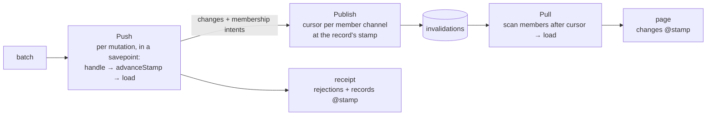

# Engine

The server engine is pure protocol logic in Rust: it never opens a connection or a transaction itself, but drives the host through a fixed set of operations.

- [Push](push.md) — Validate and deduplicate legacy mutation batches, invoke handlers and produce receipts.
- Operation execution — Claim each Mutation or Query call independently, run its handler in a savepoint, refuse a Query settlement with effects, resolve Model outputs through versioned loaders and save its result for immutable replay.
- [Pull](pull.md) — Find changes by channel cursor and invoke loaders to return records.
- [Publish](publish.md) — Settle changed records and persistent Channel memberships: one stamp per changed record, one cursor per affected Channel/record pair.

## How the parts work together

One stamp per change, allocated in Push; Publish and Pull only carry it.

The operation executor also runs inside the application's transaction, for both kinds and both delivery paths. It claims a canonical call before validating its arguments, so a retry returns that call's saved result even after a later batch. A fresh call settles its changed records (input targets plus extra touches), then reads its input targets and explicit Model outputs through loaders; an explicit Model output reuses the stamp settlement allocated or acquires the record's stamp before loading, without advancing it. Input targets are mandatory caller authority; explicit outputs are caller authority only as the call's `store` policy selects; an extra touch alone is never caller authority, so it may name a Model the caller did not declare. Outputs are never filled from inputs, even when names match ([Mutations and Queries](../../schema/actions.md#3-context-and-scope)). A Query whose settlement carries changes or memberships is rejected with `query.effects_forbidden` before any stamp, readback or publication ([Mutations and Queries](../../schema/actions.md#8-crosscutting-concepts)). A rejected call rolls back its own savepoint, while a persistence fault aborts the transaction. The legacy mutation path described in [Push](push.md) remains available.

A handler writes to the application's database, may touch extra changed records and may add or remove persistent Channel memberships. When it returns, the shared settlement ([Publish](publish.md)) allocates one new version number (the *stamp*) per changed record and gives each affected Channel/record pair one new position (the *cursor*) at the record's current stamp, stored in the invalidation table; publishing never allocates a stamp. Push then reads the uploaded targets back through the application's loaders at the version the client declared and puts that content, with its stamp, in the receipt; extra changes are distributed but not read back. When a client pulls that channel, [Pull](pull.md) scans the invalidation table past the client's cursor for records that are still members, asks the loaders for the current rows and returns them with the records' current stamps. The client completes the mutation from the receipt alone and applies content from every path in stamp order, so a receipt and a page for the same change agree, and the same record can be published to several channels without conflict.

## Code map

| Part | Code location |
|---|---|
| Push | [server/lib.rs](../../../../../crates/server/src/lib.rs) (`process_push`, `decode`); input-target readback in [server/readback.rs](../../../../../crates/server/src/readback.rs) (`read_back`) |
| Operations | [server/actions.rs](../../../../../crates/server/src/actions.rs) (`execute_action`, `process_action_push`); host dispatch in [server/index.mts](../../../../../packages/server/index.mts) |
| Pull | [server/lib.rs](../../../../../crates/server/src/lib.rs) (`process_pull`) |
| Publish | shared settlement in [server/settlement.rs](../../../../../crates/server/src/settlement.rs) (`settle_changes`); the external path in [server/lib.rs](../../../../../crates/server/src/lib.rs) (`settle_external`); `collect`, `transaction` and `WakeHub` in [server/index.mts](../../../../../packages/server/index.mts) |
