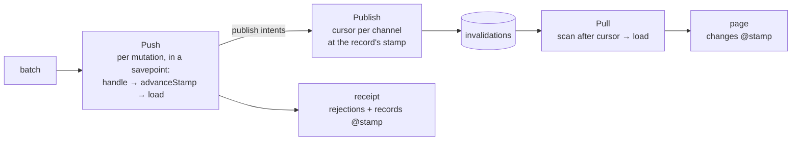

# Engine

The server engine is pure protocol logic in Rust: it never opens a connection or a transaction itself, but drives the host through a fixed set of operations.

- [Push](push.md) — Validate and deduplicate legacy mutation batches, invoke handlers and produce receipts.
- Action execution — Claim each call independently, run its handler in a savepoint, resolve Model outputs through versioned loaders and save its result for immutable replay.
- [Pull](pull.md) — Find changes by channel cursor and invoke loaders to return records.
- [Publish](publish.md) — Publish changed records to channels at their current stamps and allocate channel cursors.

## How the parts work together

One stamp per change, allocated in Push; Publish and Pull only carry it.

The Action executor also runs inside the application's transaction. It claims a canonical call before validating its arguments, so a retry returns that call's saved result even after a later batch. A fresh call reads changed records and Model outputs through loaders; an additional read-only Model output acquires its record stamp before loading. Its authority is returned at the caller's declared read version. A rejected call rolls back its own savepoint, while a persistence fault aborts the transaction. The legacy mutation path described in [Push](push.md) remains available.

A handler run by [Push](push.md) writes to the application's database, may report extra changed records (`changes.add`) and may ask for publications (`publish`). When it returns, Push allocates one new version number (the *stamp*) per changed record, reads every changed record back through the application's loaders at the version the client declared, and puts that content, with its stamp, in the receipt. [Publish](publish.md) then carries out the publications: each gives the record a new position (the *cursor*) in one channel at the record's current stamp, stored in the invalidation table; publishing never allocates a stamp. When a client pulls that channel, [Pull](pull.md) scans the invalidation table past the client's cursor, asks the loaders for the current rows and returns them with the records' current stamps. The client completes the mutation from the receipt alone and applies content from every path in stamp order, so a receipt and a page for the same change agree, and the same record can be published to several channels without conflict.

## Code map

| Part | Code location |
|---|---|
| Push | [server/lib.rs](../../../../../crates/server/src/lib.rs) (`process_push`, `decode`); readback in [server/readback.rs](../../../../../crates/server/src/readback.rs) (`read_back`) |
| Actions | [server/actions.rs](../../../../../crates/server/src/actions.rs) (`execute_action`, `process_action_push`); host dispatch in [server/index.mts](../../../../../packages/server/index.mts) |
| Pull | [server/lib.rs](../../../../../crates/server/src/lib.rs) (`process_pull`) |
| Publish | publication resolution in [server/readback.rs](../../../../../crates/server/src/readback.rs) (`publish_one`); the external path in [server/lib.rs](../../../../../crates/server/src/lib.rs) (`publish`); `changes`, `publish` and `WakeHub` in [server/index.mts](../../../../../packages/server/index.mts) |
