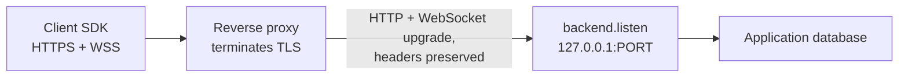

# Deploy the backend

This page describes the deployment configuration the current backend supports and where its trust boundaries lie. It documents what the listener does today; it does not promise capabilities the runtime does not have.

## What the listener is

`backend.listen({ port, host? })` starts one Node HTTP server inside your application's process. It serves durable `POST /sync/mutations`, direct `POST /sync/actions`, `POST /sync/pull` and the WebSocket upgrade on `/sync/live` on one port. Everything else answers `404`; other methods answer `405`.

| Property | Current behavior |
| --- | --- |
| Process placement | Embedded in the Node process that runs your handlers and loaders. One process per backend instance. |
| Bind address | `host` defaults to `127.0.0.1`. Pass `0.0.0.0` or `::` only when something in front of the process controls who can reach it. |
| TLS | Not built in. The listener speaks plain HTTP and `ws://`. |
| CORS, compression, request logging | Not built in. |
| Proxy headers (`X-Forwarded-*`, `Forwarded`) | Not read by the runtime. `authenticate` receives the raw Node `IncomingMessage`; nothing rewrites the client address or scheme. |
| Body and frame limits | HTTP bodies over 1 MiB answer `413 request_too_large`; WebSocket frames over 1 MiB close the socket. The limits are fixed. |
| Live wakeups | Process-local. A commit in this process wakes the subscribers connected to this process. Distributing wakeups across several processes needs application infrastructure and is not supported yet. |
| Shutdown | `await server.close()` stops new upgrades, closes live sockets with `1001`, then closes the listener. Your application closes its database pool separately. |

## Supported configuration

Run the backend on loopback and put a reverse proxy in front of it. The proxy owns TLS, the public hostname and any request logging; the backend owns authentication and the sync protocol.



The proxy must do three things:

1. **Forward the two POST routes** to the loopback listener unchanged, including the request body. The body limit is enforced by the backend; a stricter limit at the proxy is fine.
2. **Pass the WebSocket upgrade through** on `/sync/live`. The upgrade is an HTTP `GET` with `Upgrade: websocket`; the proxy has to forward that request and then relay bytes in both directions until either side closes. Set the proxy's idle timeout for this route long enough for a quiet subscription: the backend sends nothing while no record changes.
3. **Preserve the `Authorization` header** on every request and on the upgrade. Both SDKs send `Authorization: Bearer <token>`, and `authenticate` reads it from the forwarded request. A proxy that strips or replaces it makes every request `401` and refuses every upgrade.

A minimal nginx location that meets these requirements:

```nginx
location /sync/ {
    proxy_pass         http://127.0.0.1:4242;
    proxy_http_version 1.1;
    proxy_set_header   Upgrade $http_upgrade;
    proxy_set_header   Connection "upgrade";
    proxy_set_header   Authorization $http_authorization;
    proxy_read_timeout 3600s;
}
```

Use your own token format and verify it in `authenticate`; `devAuth` trusts the header verbatim and is for local development only ([Authentication](api.md#authentication)).

## Trust boundaries

- **Everything reaching the listener is trusted to have come through your proxy.** The runtime does not authenticate the proxy and does not read forwarded-for headers, so bind to loopback (or a private interface) and let the proxy be the only route in.
- **Identity comes from `authenticate` alone.** The user id it returns is the owner used for every host operation in that request. A client identity is bound to the first owner that pushed with it; a push from another user with the same client id answers `403 client.owner_mismatch` ([Errors](api.md#errors)). Give each signed-in user their own local client database ([Authentication and account changes](../frontend/sync.md#authentication-and-account-changes)).
- **Authorization is application code.** Handlers decide what a user may write and loaders decide what a user may see, per channel; the runtime enforces no channel-level policy ([What your backend owns](api.md#what-your-backend-owns)).

## What has been validated

`integration/persistence/server/runtime.test.mjs` runs the real backend on loopback behind an in-process reverse proxy that forwards HTTP requests and passes the WebSocket upgrade through at the TCP level, with headers preserved. Through that proxy, a push answers `200`, a pull returns the pushed record, a live subscription is acknowledged and receives the page for a later push. The same test shows the header requirement: a proxy that strips `Authorization` gets `401` on HTTP and a refused upgrade.

Not validated by the repository's tests, and therefore not claimed:

- TLS termination and any specific proxy product (nginx, Caddy, cloud load balancers). The configuration above follows their documented WebSocket support; verify it in your environment.
- Browsers. The client SDKs run on Node and Flutter; browser support is a separate decision.
- More than one backend process behind the proxy. Live wakeups are process-local, so a client connected to one process does not learn about commits made through another until it pulls.
